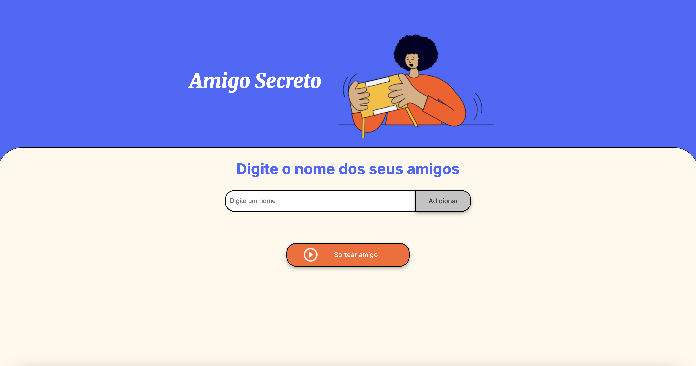

# Amigo Secreto

**Amigo Secreto** é uma aplicação web onde os usuários podem adicionar nomes a uma lista e, de maneira aleatória, sortear um "amigo secreto" entre os participantes.

## Funcionalidades

- Adicionar nomes dos participantes do Amigo Secreto na lista
- Sortear e escolher um "amigo secreto" de forma aleatória da lista
- Exibir o nome selecionado do amigo

## Stack utilizada

A aplicação foi construída usando HTML, CSS e JavaScript. A funcionalidade principal está contida no aquivo **app.js**, onde encontramos as funções para adicionar nomes na lista, selecionar um amigo aleatório e mostrar o resultado.

## Demonstração

Acesso ao projeto pela URL (link): https://2025aluradesafioamigosecreto.vercel.app/

## Feedbacks

Por favor, sinta-se a vontade para fornecer sugestões de melhorias ao código fonte.

