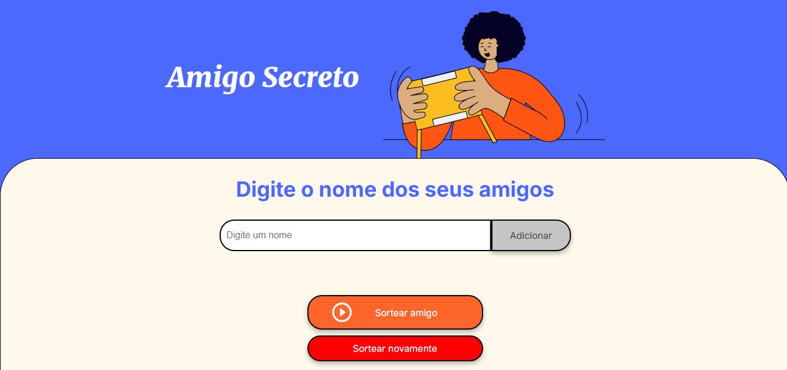

# Amigo Secreto

**Amigo Secreto** é uma aplicação web que permite que os usuários adicionem nomes em uma lista e de forma aletória selecionar um "amigo secreto" da lista.

## Funcionalidades

- Adicionar nomes na lista
- Selecionar um "amigo secreto" de forma aleatória da lista
- Exibir o nome do amigo selecionado

## Stack utilizada

A aplicação foi construída usando HTML, CSS e JavaScript. A funcionalidade principal está contida no aquivo **app.js**, onde encontramos as funções para adicionar nomes na lista, selecionar um amigo aleatório e mostrar o resultado.

## Demonstração

Você pode acessar o projeto pelo link: https://amigo-secreto-alura-one-self.vercel.app/

## Feedback

Feedbacks são sempre bem-vindos, por favor, fique a vontade para me dar um retorno.

